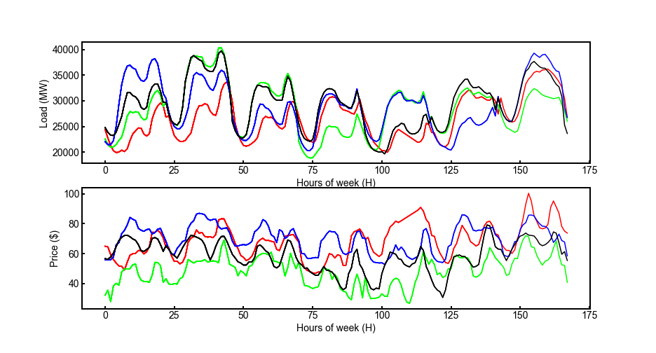
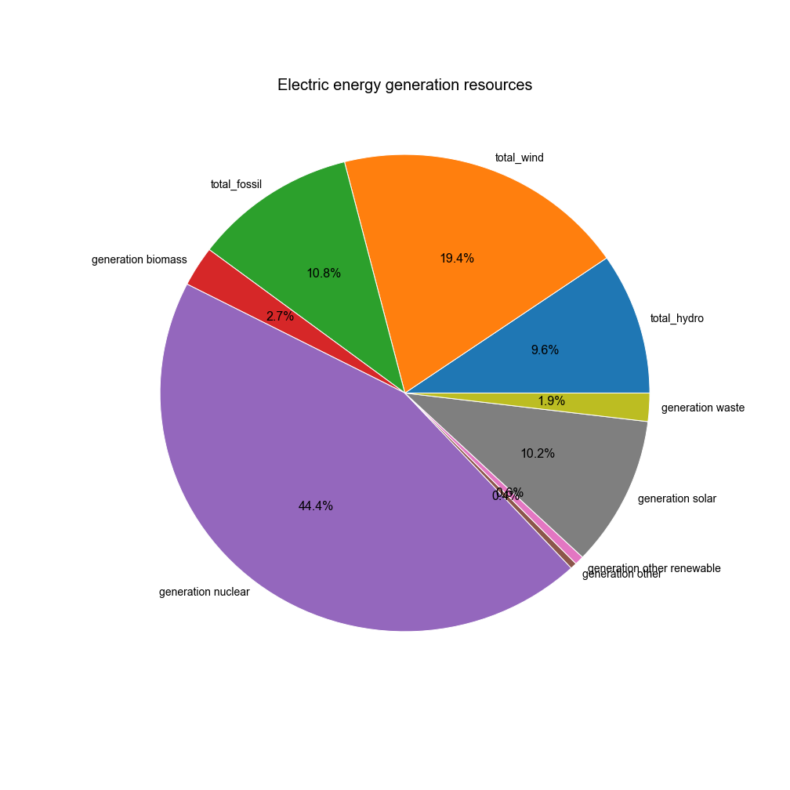
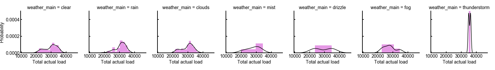
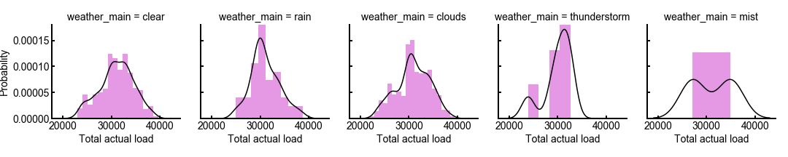
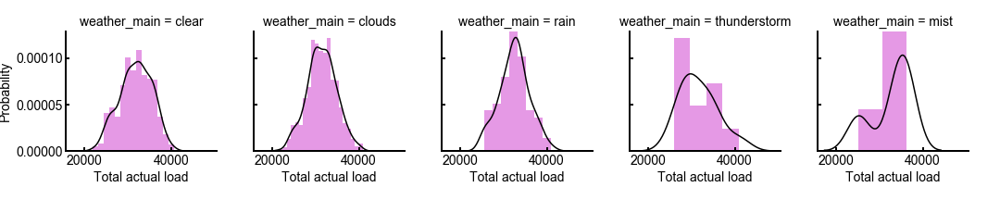
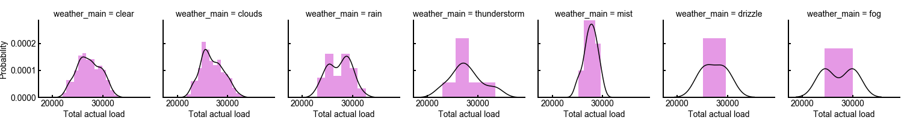
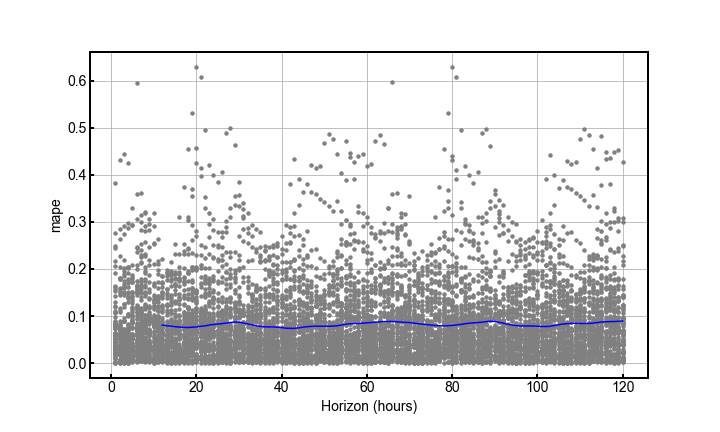

<b>Sarvenaz Memarzadeh - Ph.D. candidate in Electrical Engineering</b>

<b>University of Maryland - College Park</b>

<b>smemarza@umd.edu</b>

# Data incubator project proposal 
## Table of Contents
1. [Topic of proposal](#topic)
2. [Introduction](#introduction)
3. [Analysis and results](#analysis)
4. [Data visualization](#datavis)
5. [Time series prediction](#timeseries)

## Topic of proposal:
Prediction of the future electricity load and price based on the available weather features using 
temporal patterns (time series analysis). 

## Introduction 

Forecasting is one of the major challenges in data science and often providing a reasonable prediction is not an easy task. Specifically, forecasting the energy load and price from historical data benefits a wide range of spectrum; from researchers and engineers in power agencies, transportation systems, vehicle manufacturers, consulting managements, to the local and national governments, energy forecast is the most valuable data. Furthermore, tackling climate change is another main concern of the recent world.  The effect of climate change can impact many industries; therefore, before any critical conditions happen we need to think of a way to tackle the situation.  
Things become more interesting when these two critical problems meet, that is, the energy load forecast and climate change. For this proposal, I am interested in studying the combination of these two factors together. I want to investigate the machine learning approaches to successfully forecast the electric power demand and market price based on meteorological variables such as temperature, humidity, rain, wind and so on. 

## Analysis and results 

For the data incubator project in summer 2020, I am interested in the implementation of the time series forecasting methods from the historical data to predict the electric load and consequently its market price by considering the effect of the meteorological conditions.  
To start, I downloaded two available datasets from the Kaggle website.   
1) Energy dataset: Consist of the hourly electric load generation from different energy resources such as fossil, solar, nuclear, wind, hydro, etc over the years of 2015 to 2018 in the 5 largest cities of Spain; Barcelona, Bilbao, Madrid, Seville, and Valencia. However, for the analysis part here, I have only focused on one city "Valencia" for now.  
2) Weather dataset: Consist of the hourly weather conditions for the same geographical locations over the past 4 years. Fortunately, the weather conditions are pretty much versatile which can result in the more general interpretation and prediction of the electric load (or market price) at the end.   
For the data analysis, specifically manipulations and visualization part, I have used Python's software packages such as Pandas and Seaborn.  

## Data visualization
For data visualization, I have plotted three figures.  The first figure shows the electrical load demand curves and the actual electrical price during the first week of months January, April, August, and December of 2015.  

Based on this figure, we can see the oscillations of the load plots over different hours of the days. According to that, there are 7 oscillations each related to one day of the week, starting from Monday. Also, It appears that there are two peaks indicating two main intervals for the electric load consumption every day over the period of one week. Plus, the load trend looks independent and approximately similar all over January, April, July, and October.  
One interesting point is that the two load peaks that are distinguishable during weekdays, merge into one over the weekends. This denotes the high and approximately uniform load distribution over the morning to evening hours on the weekends (especially on Sundays). In the second subplot, I have plotted the electric price over the same interval over January, April, July, and October.  There seems to be a correlation between the two plots as the electric load increases, also price increases and vice versa.    

For the second visualization, I have plotted a pie chart showing the mean percentage value of electric generation due to all different types of available energy resources over the past 4 years.  To further simply, as there are multiple methods for generation of electric load through fossil(e.g. brown coal, coal-derived gas, hard coil, ...), wind (e.g. onshore, offshore), and hydro (e.g. pumped storage,run-of-river, and poundage,..), I have grouped them each individually in one list as the total_hydro, total_fossil, and wind; and then calculated the mean values of the **total** of the fossil, wind and hydro.
From the pie chart below you can see the majority of the electric load generation is due to nuclear energy. 

Lastly, to show the effect of the weather features on the electric loads, I have employed Seaborn library and plotted the probability distribution of the total electric load based on each weather features over the selected hours (i.e. 7 am, 1 pm, 6 pm, and 10 pm). Some of the results and observations are:

- The probability of load distributions (even at a specific time of the day) are compeletly different and it depends on the weather conditions.
- The variance of the distributions is different.  The data is more spread between (2000MW - 4000MW) for the morning and afternoon hours, and it shifts down to (2000 MW - 3000 MW) for the late-night hours.
- Interestingly, the thunderstorm weather makes the total load higher compared to the other weather conditions. Also, the distribution has a smaller standard deviation compared to the other features.

## Time series prediction

To start with the available time series models, I have download and employed the open-source software of the "Prophet Forecasting Model" released in Python by Facebook research teams. The core algorithm behind the Prophet is the "additive regression model".  The forecast can be slightly tweaked using the easily-interpretable parameters.  Another main component of this model is the user-provided list of important holidays. 

First, I imported and fitted the model over the mask that only covers 2015. This is the first attempt of me for the time series predictions using this package and the year selection was completely arbitrary.
Time series cross-validation is performed for the error prediction of the model. To do so, from the "Prophet Forecasting Model", I have imported the cross_validation function to assess the prediction performance by specifying the "forecast horizon" and the "initial training period" as the input parameters. Then, the cross-validation procedure can be done for a range of historical cutoffs. 

The output of the cross_validation function is a data frame with the true value y and the forecast value yhat, at each simulated forecast date and for each cutoff date. In particular, a forecast is made for every observed point between cutoff and cutoff + horizon. This data frame can then be used to compute error measures of yhat vs. y. I made the prediction (yhat) of the total load actual using the first 180 days in 2015 as the training samples and 5 days as the horizon value.  Since the model training procedure took about a day, I have saved the cross-validated output in a .pkl format (df_cv.pkl) for further analysis.   

Finally, to evaluate the performance of the model, I used the Prophet performance_metrics function which calculates its mean absolute percentage error (MAPE).  I plotted the MAPE over the horizon period of (5 days = 120 Hours) as shown in the figure below. The blue line demonstrates the MAPE of (~ 8%), where the mean is taken over a rolling window of the dots which are the absolute percent error for each prediction in the cross-validated data.  

